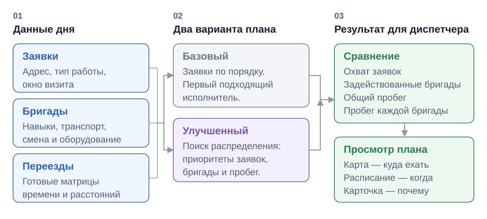
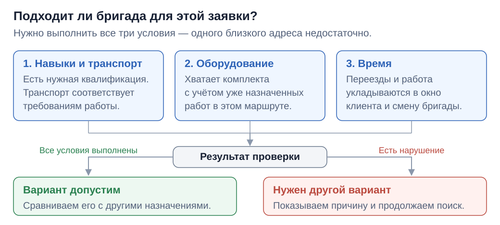
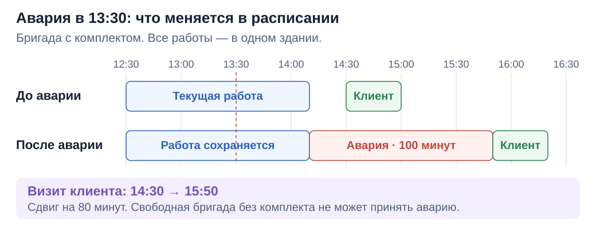
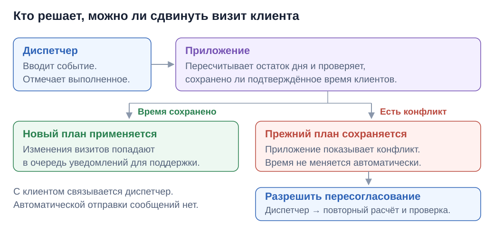

# Wayfinder — планировщик маршрутов выездных инженеров

## 🚀 [Открыть Wayfinder — попробовать в браузере](https://wayfinder-preview.layero.app/)

**Нажмите на ссылку выше, чтобы посмотреть проект в действии. Установка не нужна.**

Wayfinder помогает диспетчеру распределить заявки между бригадами и составить план выездов на день. Решение разработано по кейсу «Билайн Бизнес»: оно учитывает не только расстояния, но и квалификацию инженеров, время визитов, транспорт и запас оборудования.

## Установка и локальный запуск

Для запуска нужны **Node.js 24 LTS** (версия 24.4.0 или выше в ветке 24), **pnpm 11.15.0** и современный браузер. Подойдут Windows, macOS и Linux. Данные для демонстрации уже включены в проект — настраивать базу данных, получать ключи API или создавать `.env` не требуется.

### 1. Установите Node.js и pnpm

Скачайте Node.js ветки **24 LTS** с [официального сайта](https://nodejs.org/) и установите его. npm устанавливается вместе с Node.js.

Откройте терминал: **PowerShell** в Windows или **Terminal** в macOS/Linux. Если он был открыт во время установки, закройте и откройте его заново. Проверьте Node.js:

```bash
node --version
```

Команда должна вывести версию вида `v24.x.x`, не ниже `v24.4.0`. Затем установите менеджер пакетов pnpm:

```bash
npm install --global pnpm@11.15.0
pnpm --version
```

Ожидаемый результат последней команды — `11.15.0`.

### 2. Перейдите в папку проекта

Если проект получен архивом, сначала распакуйте его. Откройте терминал в папке `wayfinder_preview` или перейдите в неё командой `cd`, указав свой путь:

```bash
cd "путь/к/wayfinder_preview"
```

Вы должны оказаться в папке, где лежат `package.json` и `pnpm-lock.yaml`. Все дальнейшие команды выполняются **из этой папки**.

### 3. Установите зависимости

```bash
pnpm install --frozen-lockfile
```

Дождитесь завершения установки. Для этого шага нужен интернет. Команда скачивает библиотеки в версиях, зафиксированных в проекте; выполнять её перед каждым запуском не нужно.

### 4. Запустите приложение

```bash
pnpm dev
```

Откройте в браузере **[http://127.0.0.1:5173](http://127.0.0.1:5173)**. Терминал оставьте открытым — пока команда работает, приложение доступно по этому адресу.

При первом открытии загрузится территория «Восток» и рассчитаются два варианта плана. После расчёта можно выбирать заявки на карте, смотреть расписание и переключаться между базовым и улучшенным планами.

Чтобы остановить приложение, нажмите **Ctrl+C** в терминале. Для повторного запуска снова выполните `pnpm dev` из папки проекта.

**Если что-то не работает:**

- Команда `node` или `pnpm` не найдена — перезапустите терминал и проверьте установку командами выше.
- Порт 5173 занят — остановите предыдущий запуск приложения через Ctrl+C и попробуйте снова.
- Карта без подложки — проверьте интернет: фон карты загружается из OpenStreetMap. Данные и расчёт плана работают локально.

## Сайт и материалы

| Материал | Ссылка |
| --- | --- |
| Сайт проекта | [Wayfinder](https://wayfinder-preview.layero.app/) |
| Репозиторий | [GitHub](https://github.com/hineoni/wayfinder_preview) |
| Презентация PDF | [Открыть](#) |
| Презентация PPTX | [Открыть](#) |
| Демонстрационное видео | [Смотреть](#) |
| Презентация HTML | [Открыть](docs/presentation/index.html) |

HTML-презентация открывается в браузере: стрелки переключают слайды, `F` включает полный экран.

## Какую задачу решает Wayfinder

При планировании выездов недостаточно назначить ближайшего инженера. Он может не иметь нужной квалификации или оборудования, не успеть в окно клиента либо уже выполнять другую работу. А новая авария в середине дня может потребовать пересмотра нескольких следующих визитов.

Wayfinder собирает эти условия в одном плане. Диспетчер видит, кто и куда поедет, когда начнётся обслуживание, сколько времени займут работа и дорога, какие заявки остались без исполнителя и почему. При изменении дня приложение пересчитывает оставшуюся работу и показывает последствия для клиентов и бригад.

### От заявок к плану дня



## Особенности решения

### Два плана для сравнения

Базовый алгоритм назначает заявки по порядку первому подходящему инженеру. Улучшенный ищет более выгодное распределение с учётом приоритетов заявок, числа задействованных бригад и пробега. Оба варианта можно сравнить на одних данных: по охвату, маршрутам и километражу каждой бригады.

### Объяснение назначений

Карточка заявки показывает, почему выбран конкретный исполнитель: подходящие навыки и транспорт, доступное время, оборудование и положение визита в маршруте. Для неназначенных заявок видна причина отказа. Диспетчер может посмотреть альтернативных исполнителей и вручную изменить назначение до начала оперативного перепланирования.

**Почему ближайшая бригада не всегда подходит**

Схема показывает три группы условий для одного назначения. Если кандидат не подходит, поиск рассматривает другие бригады или другое положение заявки в маршруте.



### Перепланирование в течение дня

Можно добавить аварию, отменить заявку или отметить недоступность бригады. Диспетчер подтверждает выполненные визиты, после чего приложение сохраняет историю и пересчитывает остаток дня с учётом начатых работ и оставшегося оборудования. События можно применять последовательно; изменения времени и исполнителей видны в сравнении с предыдущим планом.

**Пример: авария в 13:30**

В сценарии «Демо: конфликт аварии» бригада с комплектом уже работает до 14:10. Свободная бригада без комплекта принять аварию не может. На шкале видно, что текущая работа сохраняется, а будущий клиентский визит сдвигается на 80 минут.



Это учебный случай: все работы находятся в одном здании. Шкала показывает длительность работ; свободные промежутки между ними остаются пустыми. Если время клиента заранее подтверждено, его изменение потребует явного разрешения на пересогласование.

### Согласования с клиентами

Подтверждённое время визита становится ограничением для следующего пересчёта. Если сохранить его не удалось, диспетчер увидит конфликт и сможет явно разрешить пересогласование. Отдельная очередь показывает, кого нужно уведомить; её можно скачать в TXT. Сообщения клиентам автоматически не отправляются.



### Проверка плана до выезда

Можно оценить последствия задержки на 15, 30 или 60 минут, проверить реакцию на модельные аварии и подобрать передачу аварийного комплекта между бригадами до начала дня. Такие проверки помогают увидеть уязвимые места расписания и оборудования заранее.

### Работа со своими данными

В разделе **«Свои данные»** можно загрузить CSV или JSON и построить план. При ошибке приложение указывает проблемные строки или записи. Файл обрабатывается локально, результат планирования экспортируется в JSON.

| Пример | Что содержит |
| --- | --- |
| [Заявки CSV](datasets/samples/orders.csv) | 8 заявок; используются бригады выбранной территории. |
| [Сценарий JSON](datasets/samples/scenario.json) | 8 заявок и 3 бригады с параметрами работы. |

## Данные и границы модели

В проект включены три территории — **Восток, Юго-восток и Югоцентр**, всего 205 исходных заявок. Отдельный сценарий **«Демо: конфликт аварии»** показывает, как срочная работа влияет на будущий визит клиента и почему ближайшая бригада без комплекта не может принять аварию.

План учитывает окно начала обслуживания, смену, квалификацию, транспорт и конечный запас оборудования. Авария длится 100 минут. Приоритеты: аварии, затем подключения, затем ремонт и дозаказы.

Алгоритм использует ограниченный поиск и не гарантирует глобально оптимальное решение. Сравнение проводится с базовым алгоритмом при принятых модельных условиях. Переезды к новым координатам рассчитываются приближённо; это отмечается в интерфейсе. Проверки аварий и задержек описывают отдельные сценарии, а не гарантируют соблюдение SLA во всех случаях.

| Документ | Что можно узнать |
| --- | --- |
| [Описание датасетов](datasets/README.md) | Откуда получены данные, как устроены CSV/JSON и какие приняты допущения. |

## Что находится в проекте

Интерфейс написан на **Vue 3 и TypeScript**, собирается через **Vite**. Для состояния используется **Pinia**, для карты — **Leaflet**. Алгоритм планирования отделён от интерфейса и работает с подготовленными данными без запросов к внешним сервисам.

| Папка или файл | Что внутри |
| --- | --- |
| [apps/web/](apps/web/) | Веб-приложение: карта, расписание, карточки заявок, импорт, события и согласования. В `src/modules/planning` сосредоточена работа с планом, в `src/shared` — общие элементы интерфейса. |
| [packages/planner/](packages/planner/) | Алгоритмы базового и улучшенного планов, перепланирование, проверка ограничений, объяснения и метрики. |
| [packages/dataset/](packages/dataset/) | Чтение и проверка CSV/JSON, преобразование данных в формат планировщика, работа с матрицами переездов. |
| [tools/prepare/](tools/prepare/) | Подготовка данных: геокодирование адресов, получение маршрутов, сборка наборов и запуск бенчмарка. |
| [tools/arch-check/](tools/arch-check/) | Тесты, проверяющие допустимые зависимости между частями проекта. |
| [datasets/raw/](datasets/raw/) | Исходные CSV кейса, сохранённые без изменений. |
| [datasets/prepared/](datasets/prepared/) | Готовые наборы, матрицы времени и расстояний, геометрия маршрутов. Эти файлы используются при запуске приложения. |
| [datasets/samples/](datasets/samples/) | Небольшие CSV и JSON для знакомства с импортом своих данных. |
| [docs/presentation/](docs/presentation/) | HTML-презентация, стили и изображения. |
| [docs/diagrams/](docs/diagrams/) | Схемы работы приложения для README в формате SVG. |
| [package.json](package.json) | Команды проекта и зависимости инструментов разработки. |
| [pnpm-lock.yaml](pnpm-lock.yaml) | Зафиксированные версии зависимостей для воспроизводимой установки. |
| [pnpm-workspace.yaml](pnpm-workspace.yaml) | Список пакетов, объединённых в проект. |

## Проверки и сборка

Команды выполняются из корня проекта после установки зависимостей.

| Команда | Назначение |
| --- | --- |
| `pnpm check` | Полная проверка: TypeScript, линтеры, форматирование, тесты, сборка и зависимости между модулями. Не требует сети. |
| `pnpm build` | Создаёт готовую сборку приложения в `apps/web/dist/`. |
| `pnpm preview` | Открывает собранное приложение локально на `http://127.0.0.1:4173`. Сначала выполните `pnpm build`. |
| `pnpm benchmark` | Выводит отчёт сравнения планов и стрессовых сценариев в терминал. |
| `pnpm datasets` | Пересобирает подготовленные данные с обращениями к Nominatim и OSRM. Для обычного запуска не требуется. |
